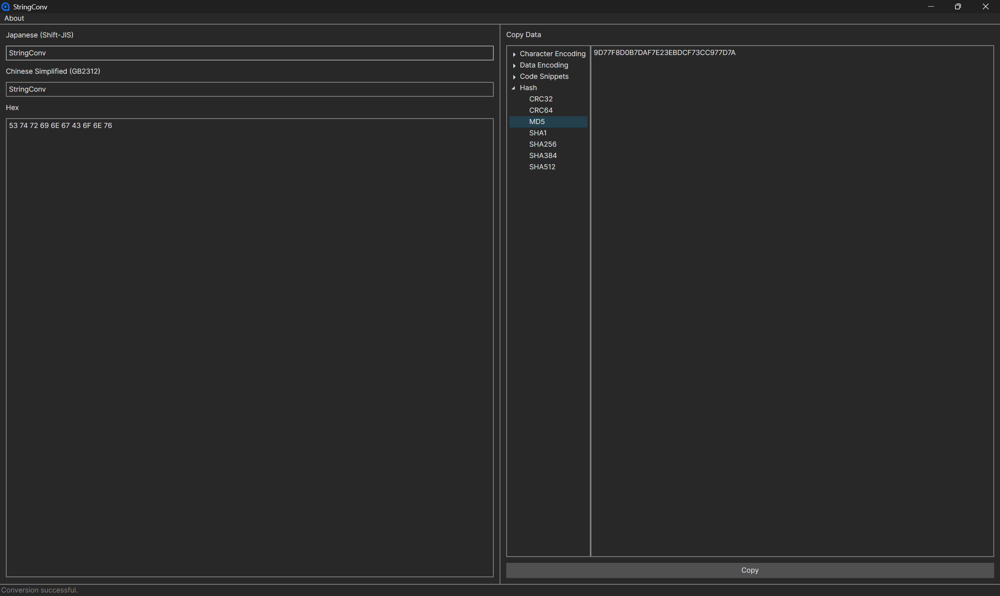
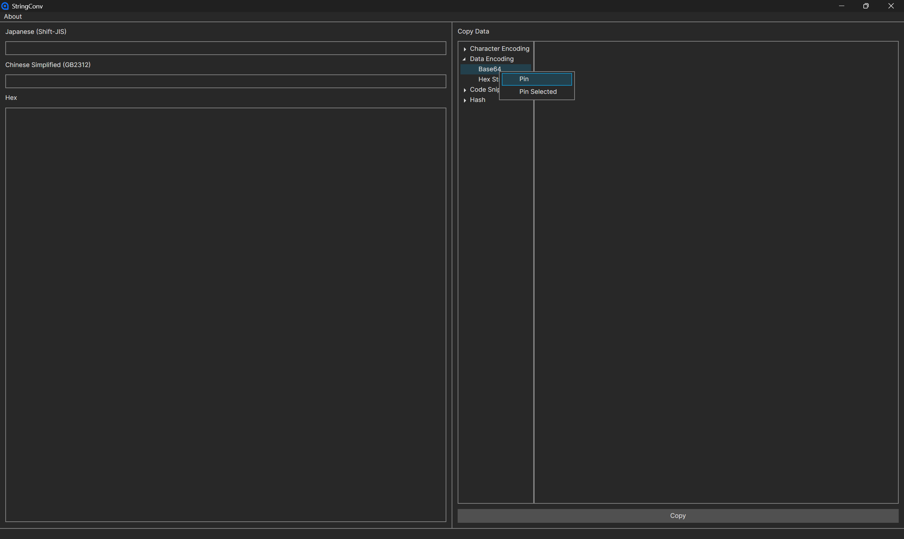
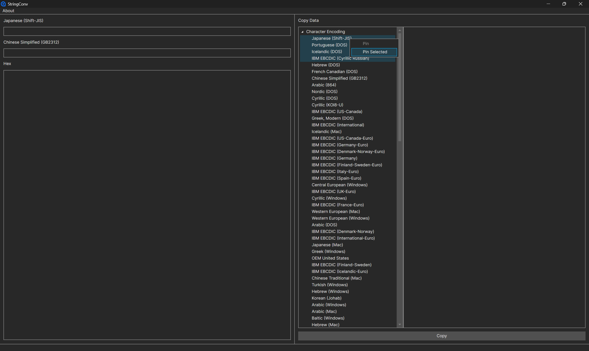
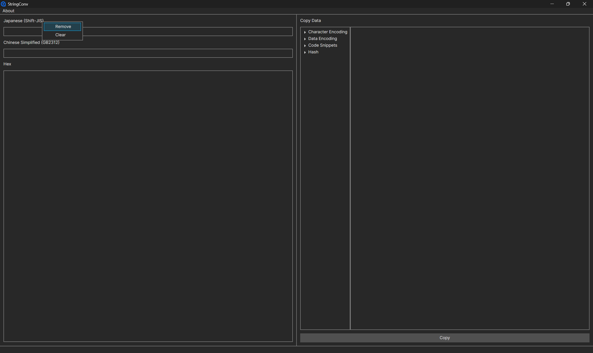

# StringConv

  

A simple string conversion tool for reverse engineers and translators.

## Download

[Releases](https://github.com/detached64/StringConv/releases)

Get ci builds [here](https://github.com/detached64/StringConv/actions/workflows/build.yml).

## Usage

- Right-click on the converter to pin it to the panel.

  

- Right-click on the selected converters to pin them to the panel.

  
  
- Remove the converter or clear all converters from the panel.

  

## License

MIT License
