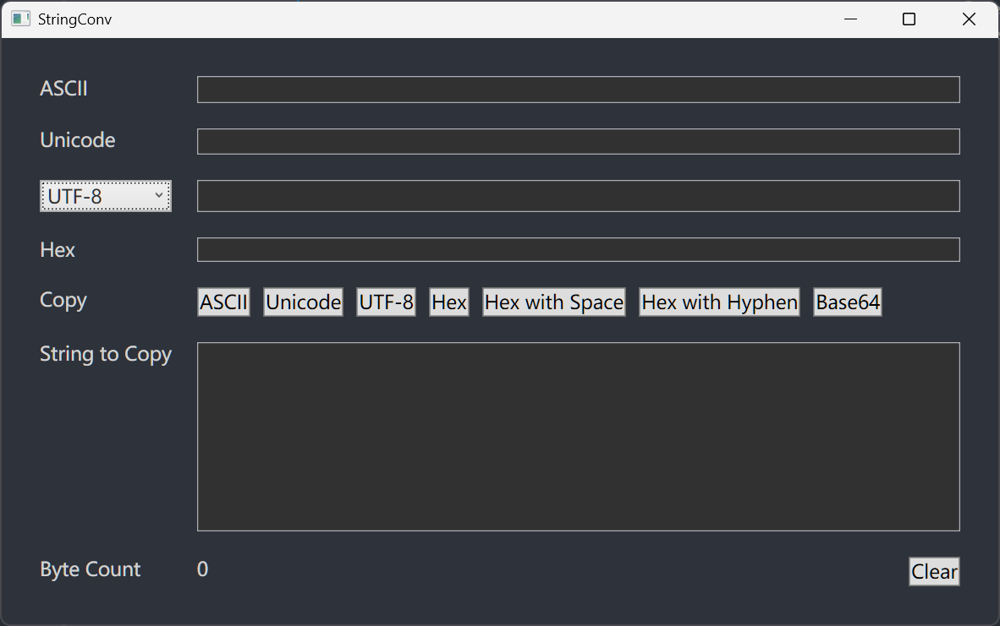

# StringConv

A simple string conversion tool for reverse engineers and translators.

## Features

* Convert between different string encodings
* Support custom encoding by adding codepages to `CustomEncodings.txt`

## License

MIT License
